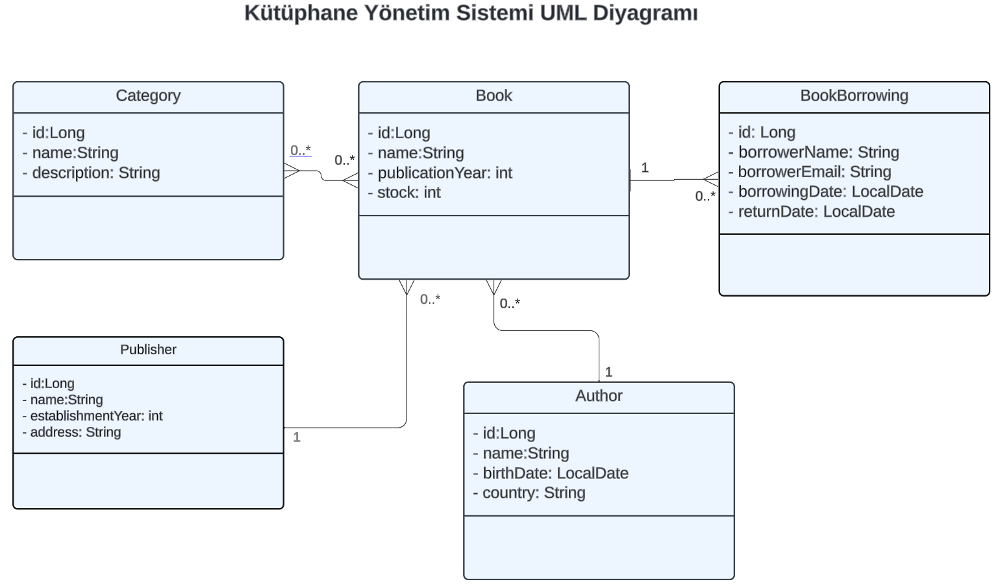

# Kütüphane Yönetim Sistemi

Kütüphaneler tarafından kullanılabilecek kayıt yönetimlerini, kitap ödünç verme ve alma işlemlerini yapabilecekleri Rest API projesidir.
## Kullanılan Teknolojiler

<code></code>
<code></code>
<code></code>
<code></code>
<code></code>
<code></code>
<code></code>
<code></code>
<code></code>
<code></code>

## Özellikler

- Yazar, kategori, yayınevi ekleme, güncelleme, silme işlemleri yapılır.
- Kitapların stok bilgileri tutulur.
- Kitapların ödünç verme ve geri alma kayıtları tutulur.

## Ekran Görüntüleri
- UML diyagram
  

## API Kullanımı
Aşağıda, API'nin sunduğu temel endpoint'lerin bir listesi bulunmaktadır:

| Endpoint                   | HTTP Metodu | Açıklama                                            |
|----------------------------|:------------|-----------------------------------------------------|
| **author**                 |             |                                                     |
| `/api/v1/authors/{id}`     | GET         | Belirtilen ID'ye sahip yazarı getirir               |
| `/api/v1/authors/{id}`     | PUT         | Belirtilen ID'ye sahip yazarı günceller             |
| `/api/v1/authors/{id}`     | DELETE      | Belirtilen ID'ye sahip yazarı siler                 |
| `/api/v1/authors`          | GET         | Tüm yazarları getirir                               |
| `/api/v1/authors`          | POST        | Yazar ekler                                         |
|                            |             |                                                     |
| **publisher**              |             |                                                     |
| `/api/v1/publishers/{id}`  | GET         | Belirtilen ID'ye sahip yayınevini getirir           |
| `/api/v1/publisher/{id}`   | PUT         | Belirtilen ID'ye sahip yayınevini günceller         |
| `/api/v1/publisher/{id}`   | DELETE      | Belirtilen ID'ye sahip yayınevini siler             |
| `/api/v1/publisher`        | GET         | Tüm yayınevlerini getirir                           |
| `/api/v1/publisher`        | POST        | Yayınevi ekler                                      |
|                            |             |                                                     |
| **category**               |             |                                                     |
| `/api/v1/categories/{id}`  | GET         | Belirtilen ID'ye sahip kategoriyi getirir           |
| `/api/v1/categories/{id}`  | PUT         | Belirtilen ID'ye sahip kategoriyi günceller         |
| `/api/v1/categories/{id}`  | DELETE      | Belirtilen ID'ye sahip kategoriyi siler             |
| `/api/v1/categories`       | GET         | Tüm kategorileri getirir                            |
| `/api/v1/categories`       | POST        | Kategori ekler                                      |
|                            |             |                                                     |
| **book**                   |             |                                                     |
| `/api/v1/books/{id}`       | GET         | Belirtilen ID'ye sahip kitabı getirir               |
| `/api/v1/books/{id}`       | PUT         | Belirtilen ID'ye sahip kitabı günceller             |
| `/api/v1/books/{id}`       | DELETE      | Belirtilen ID'ye sahip kitabı siler                 |
| `/api/v1/books`            | GET         | Tüm kitapları getirir                               |
| `/api/v1/books`            | POST        | Kitap ekler                                         |
|                            |             |                                                     |
| **book borrowing**         |             |                                                     |
| `/api/v1/borrows/{id}`     | GET         | Belirtilen ID'ye sahip kitap ödünç almayı getirir   |
| `/api/v1/borrows/{id}`     | PUT         | Belirtilen ID'ye sahip kitap ödünç almayı günceller |
| `/api/v1/borrows/{id}`     | DELETE      | Belirtilen ID'ye sahip kitap ödünç almayı siler     |
| `/api/v1/borrows`          | GET         | Tüm kitap ödünç almaları getirir                    |
| `/api/v1/borrows`          | POST        | kitap ödünç alma ekler                              |

## Kurulum
1. Projeyi klonlayın.
    - git clone https://github.com/alisimsekk/LibraryApp.git
2.1. Docker yüklü ise,
    - docker-compose up 
2.2. `src/main/resources/application.properties` dosyasında veri tabanı konfigürasyonunu yapın.
3. Projeyi ayağa kaldırmak için idenizden start edin.
4. Swagger üzerinden api kullanılabilir. Tarayıcınızdan http://localhost:8080/swagger-ui/index.html#/ url'ine gidin.
5. End pointlere istek atabilirsiniz.

## Ortam Değişkenleri

Bu projeyi çalıştırmak için aşağıdaki ortam değişkenlerini application.properties dosyasından değiştirmelisiniz.

spring.datasource.url  
spring.datasource.username  
spring.datasource.password

## Lisans

[MIT](https://choosealicense.com/licenses/mit/)

